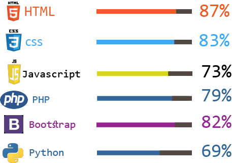

<!-- ### Hi there 👋 -->

<h1>Hello Developers();</h1>

    
 You have finally discovered my Github profile.  
    Please feel free to clone/fork projects, raise issues and submit PRs if you think something could be better.  
    Ask me anything <a href="https://github.com/mahi736/mahi736/issues/new"><b>here</b></a> 
    or <b>email</b> me at <b>mdmahin5531@gmail.com</b>
    <i>Happy Coding!</i> 😊

    <h1>About Me</h1>
    
Well there is nothing special about me.. I am a 10th class student at Rajuk Uttara Model College, Uttara, Dhaka, Bangladesh. I love to code. my favourite qoute is <i>"CODE NEVER LIES"</i> 

    <h1>My skills</h1>
    

<!-- - 🔭 I’m currently working on ...
- 🌱 I’m currently learning ...
- 👯 I’m looking to collaborate on ...
- 🤔 I’m looking for help with ...
- 💬 Ask me about ...
- 📫 How to reach me: ...
- 😄 Pronouns: ...
- ⚡ Fun fact: ... -->

